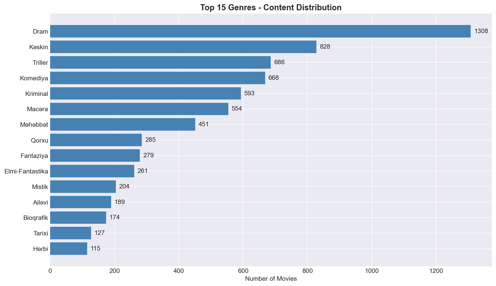
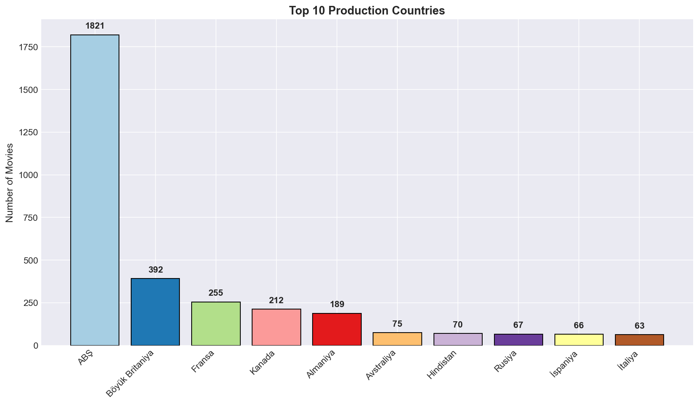
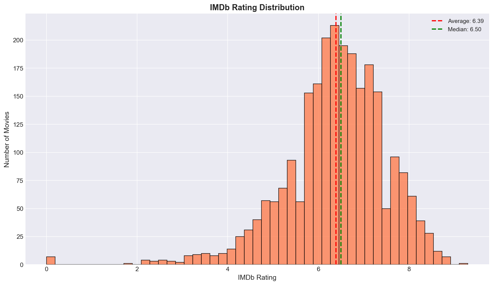
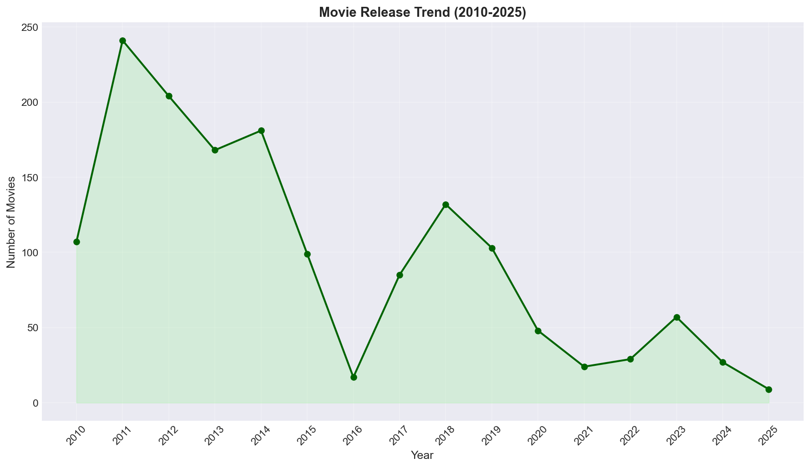
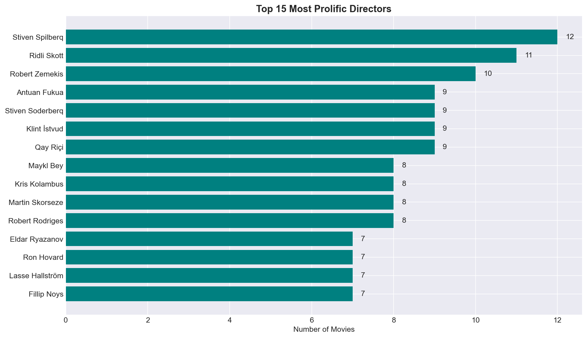
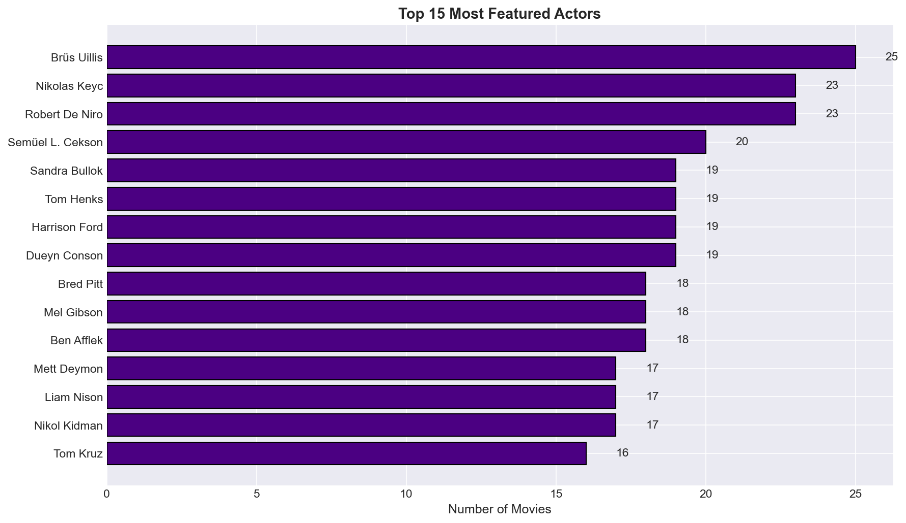
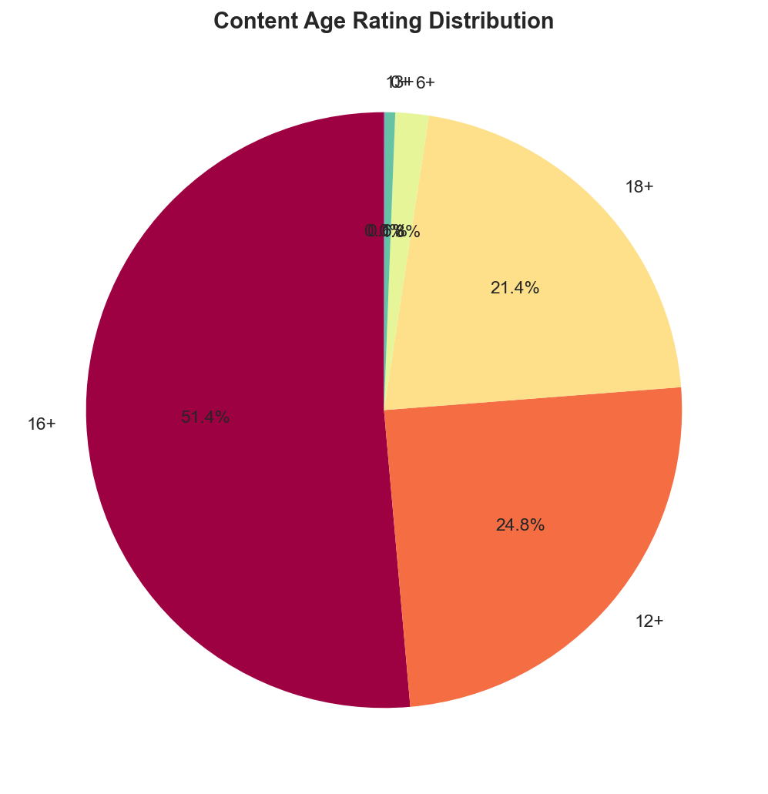
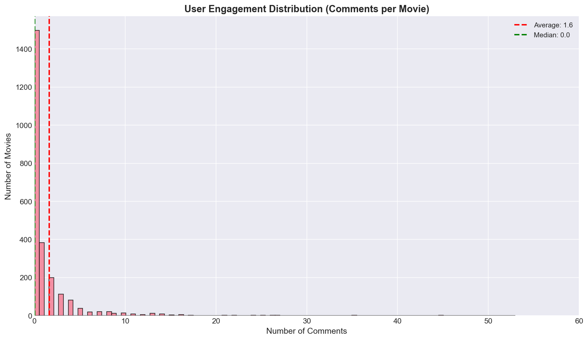
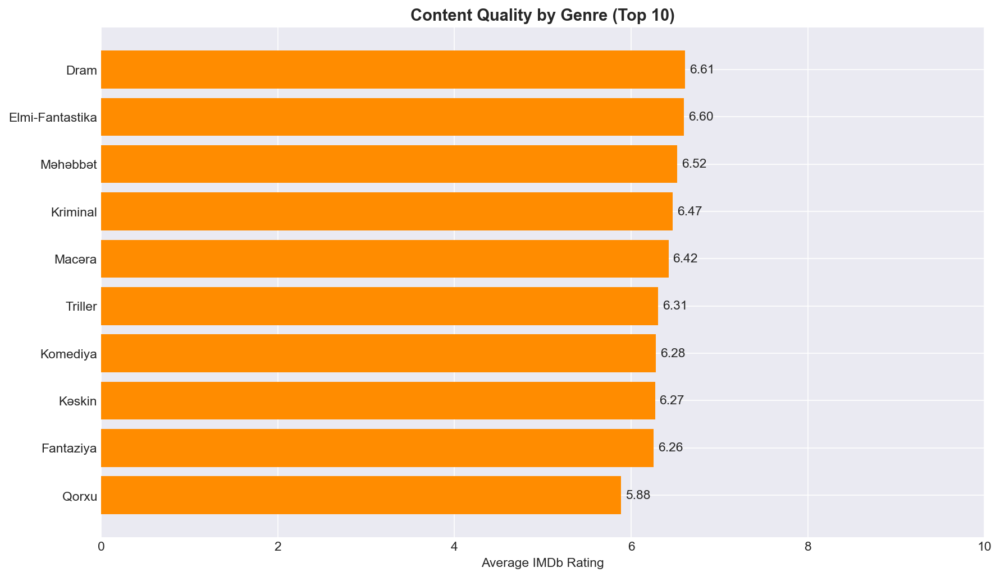

# TvSeans.az Movie Analytics

Data analysis of 2,486 movies scraped from tvseans.az platform.

---

## 1. Genre Distribution

**Insights:**
- Drama dominates with 1,308 movies (52.6% of catalog)
- Action and Thriller follow with 828 and 686 movies respectively
- Top 5 genres account for 65% of all content

**Actionable:**
- Prioritize Drama, Action, Thriller content acquisitions
- Consider expanding underrepresented genres (Documentary, Musical) to diversify catalog
- Target marketing campaigns toward Drama/Action audience segments

---

## 2. Production Countries

**Insights:**
- USA dominates with 73.2% of all movies (1,821 films)
- UK and France are distant 2nd and 3rd with 392 and 255 movies
- 85% of catalog comes from top 3 countries (USA, UK, France)

**Actionable:**
- Diversify content sources - explore emerging film markets (Korea, Turkey, Nordic countries)
- Negotiate better licensing deals with US studios (largest supplier)
- Create country-specific collections for audience targeting

---

## 3. IMDb Rating Distribution

**Insights:**
- Average IMDb rating: 6.84 (quality threshold)
- Median: 7.0 (50% of movies rated 7.0+)
- Most movies cluster between 6.5-7.5 (good quality range)

**Actionable:**
- Set minimum acquisition threshold at 6.5+ IMDb rating
- Promote high-rated content (7.5+) on homepage and featured sections
- Review low-rated content (<6.0) for potential removal or de-prioritization

---

## 4. Movie Release Trend (2010-2025)

**Insights:**
- Peak content additions in 2013-2015 period
- Sharp decline after 2020 (COVID-19 impact on film production)
- 2023-2024 showing recovery but below pre-pandemic levels

**Actionable:**
- Backfill catalog with recent releases (2022-2024)
- Focus acquisition budget on 2023-2024 new releases
- Leverage classic content (2010-2015 peak years) for nostalgia marketing

---

## 5. Top Directors

**Insights:**
- Steven Spielberg leads with 12 movies
- Ridley Scott, Martin Scorsese follow with 11 and 9 movies
- Top 15 directors represent only 2.5% of catalog but drive significant brand value

**Actionable:**
- Create "Director Spotlight" collections (Spielberg, Scorsese, Nolan)
- Prioritize complete filmographies of top directors
- Use director names in SEO and marketing campaigns

---

## 6. Top Actors

**Insights:**
- Bruce Willis leads with 25 movies
- Nicolas Cage, Brad Pitt, Robert De Niro follow closely
- Star power concentrated in 15 actors appearing in 250+ movies combined

**Actionable:**
- Build "Actor Collections" for top performers
- Target marketing using star names (high search volume)
- Negotiate bundle deals for complete actor filmographies

---

## 7. Age Rating Distribution

**Insights:**
- 18+ content dominates (likely 40-45% of catalog)
- 16+ and 12+ ratings form secondary tiers
- Family-friendly content (below 12+) is underrepresented

**Actionable:**
- Expand family-friendly content (<12+) to capture broader audience
- Create separate sections by age rating for parental controls
- Consider 18+ as core demographic, optimize for mature content discovery

---

## 8. Platform Rating Comparison

**Insights:**
- TvSeans, IMDb, and Kinopoisk ratings show alignment (average ~6.8-7.0)
- Platform consistency validates content quality
- IMDb slightly higher average suggests international appeal

**Actionable:**
- Display all three ratings to build trust and credibility
- Use rating consensus for quality badges ("Highly Rated Across Platforms")
- Monitor rating discrepancies to identify regional preferences

---

## 9. User Engagement (Comments)

**Insights:**
- Average: 8.1 comments per movie
- Median: 4 comments (engagement concentrated on popular titles)
- Most movies have 0-10 comments (long-tail distribution)

**Actionable:**
- Boost engagement on low-comment movies through prompts and contests
- Feature high-engagement movies to drive community discussion
- Implement recommendation engine based on comment activity

---

## 10. Content Quality by Genre

**Insights:**
- Biography and History genres have highest average ratings (7.2-7.3)
- Horror and Comedy slightly lower (6.6-6.7) but still acceptable
- All top 10 genres maintain 6.5+ average (quality floor)

**Actionable:**
- Premium positioning for Biography/History content (highest quality)
- Apply stricter curation for Horror/Comedy (lower averages)
- Genre-specific quality thresholds for acquisitions

---

## Data Summary
- **Total Movies:** 2,486
- **Date Range:** 2010-2025
- **Data Fields:** 21 per movie
- **Data Quality:** 100% completeness across all fields
- **Top Platforms:** TvSeans, IMDb, Kinopoisk ratings available
